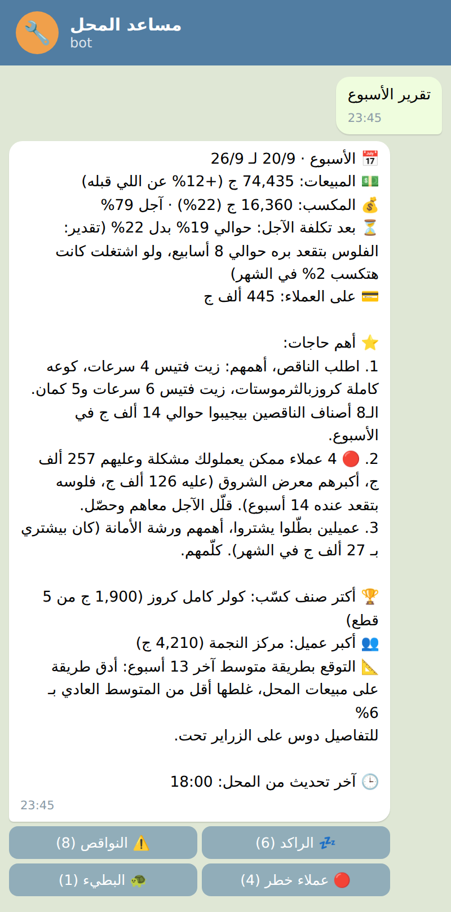
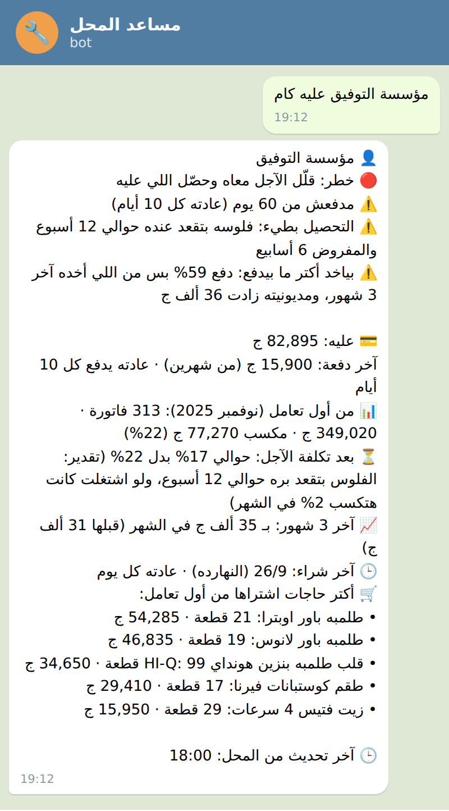
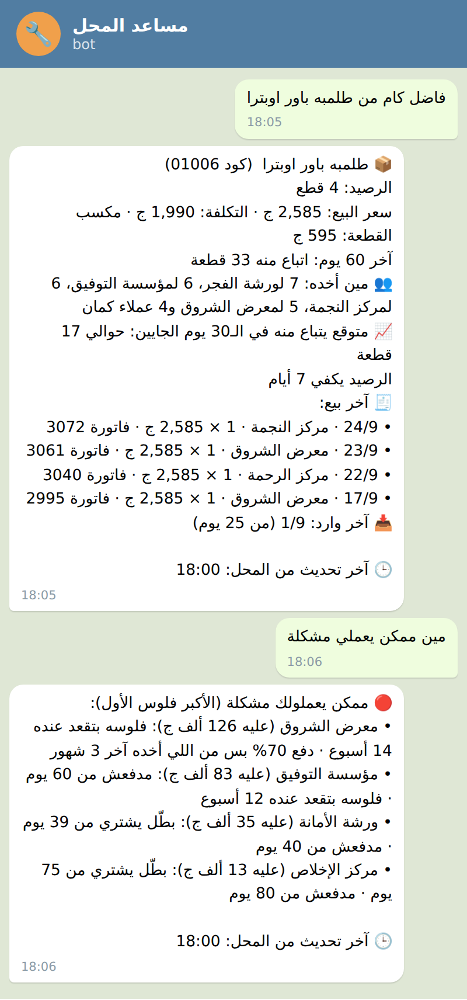
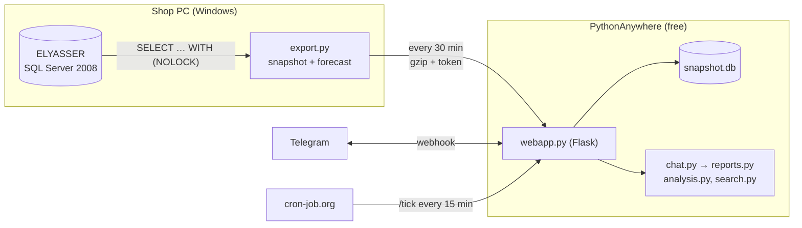

# car-bot: a Telegram assistant for an auto-parts distributor

An assistant that speaks Egyptian Arabic and turns a shop's 2008-era desktop
accounting program into answers, alerts and decisions on the owner's phone:
what is in stock, what to reorder, which stock is dead money, which traders
are worth the credit and which ones could cause trouble. It runs for free,
around the clock, even when the shop PC is off, and it never writes a
single byte to the shop's database. In use by the owner of a wholesale
auto-parts shop since September 2026.

<table>
  <tr>
    <td></td>
    <td></td>
    <td></td>
  </tr>
  <tr>
    <td align="center">The weekly report leads with 3 actions</td>
    <td align="center">A trader: verdict, reasons, history</td>
    <td align="center">An item and who bought it; risky traders</td>
  </tr>
</table>

<sub>Screenshots from the built-in demo shop: real item names, made-up numbers.
`python -m src.demo` gives the same answers. No real shop data is in this repository.</sub>

## What it does

- **Answers questions in plain Arabic**, misspellings and partial names
  included: "فاضل كام من طلمبه باور اوبترا" gives stock, price, cost, how fast
  it sells, how long the stock lasts and the demand forecast. A trader's name
  gives what they owe, when they last paid, their whole history and a verdict.
  "تقرير الأسبوع" or "مين ممكن يعملي مشكلة" work as well as the buttons.
- **Reports on its own**: an update after Asr, an end-of-day report that only
  raises alarms that matter (ran out, sold below cost, a line deleted from an
  invoice), and a weekly report that opens with the three things to do. Each
  day's report says who bought, for how much and what, with every invoice
  number one tap away, so each figure can be checked in the program.
- **Stock**: shortages ranked by what they bring in a week, with how many to
  order; idle stock with the money stuck in it (goods that arrived lately are
  not idle yet); slow movers. An item's card shows who bought it and its last invoices.
- **Traders**: keep going 🟢, watch out 🟡 or risky 🔴, with the numbers behind
  it: stopped buying, stopped paying, takes more on credit than they pay, keeps
  the shop's money longer than 6 weeks, buys much less than before, low margin,
  returns.
- **Credit has a cost**: margins are also shown after what the money waiting
  with traders would have earned, as a clearly marked estimate.

## How it works



- `src/export.py` copies what the bot needs from the accounting database into a
  small SQLite **snapshot** (no phone numbers, no addresses) and adds the
  demand forecast. `src/sync.py` sends it to the server every 30 minutes while
  the shop PC is on.
- The server only ever reads the snapshot, so the bot keeps answering from the
  latest copy when the shop PC is off; every answer says how fresh it is.
- The free host has no scheduled tasks, so reports are **event-driven**: any
  upload, message or ping from cron-job.org sends whatever report is due and
  not sent yet (`src/push.py`), once per business day (which ends at 6 am:
  the shop closes after midnight).

## Engineering notes

- **Finding the data.** The program attaches its database as a SQL Server
  *user instance* that exists only while the program is open, invisible to
  normal tools. The export finds it through `sys.dm_os_child_instances` and
  connects over its named pipe, as the same Windows user as the program.
- **Never getting in the shop's way.** Every query is a `SELECT … WITH (NOLOCK)`
  in SQL Server 2008 syntax; `tests/test_sql_rules.py` enforces both. All the
  development ran on a restored backup, never on the live database.
- **Dates typed by hand.** Invoice dates are typed by the cashier and can run
  days ahead, so live reports track documents by id ("everything entered since
  the last report"), not by date.
- **Arabic search.** Spelling folded (أ/إ/آ, ى/ي, ة/ه, Arabic digits, tashkeel),
  a spelling map for common variants, then fuzzy scoring (rapidfuzz) weighted
  by how many of the words match. Close calls between an item and a trader
  come back as buttons.
- **Written for a busy owner.** Short messages that lead with what to do; long
  lists 10 at a time; every judgement comes with its reason and numbers.
- **Tested.** 139 tests on a made-up shop with known answers, including the
  real export queries against SQL Server in Docker at compatibility level 100
  (SQL Server 2008).

## The ML part: demand forecasting, measured and not assumed

`src/forecast.py` trains one gradient-boosted model (scikit-learn,
`HistGradientBoostingRegressor`, Poisson loss) across all items on their weekly
sales, to predict the next four weeks. Spare parts sell in bursts with many
empty weeks, so the features describe the recent pace (lags, 4 to 52-week
means), how often the item sells, weeks since its last sale, trend, age,
price, and the same weeks a year earlier (NaN until there is a year of
history). A test checks that no feature can see the future.

A **rolling-origin backtest** hides the last 4, 8, 12 and 16 weeks, forecasts
them from the weeks before, and scores every method by WAPE (total miss / total
sold) and bias against simple baselines: 8- and 13-week moving averages,
Croston's method (SBA) for intermittent demand, and a model/average blend.
The export repeats it once a day, and the bot uses **whichever method misses
least**, or nothing if the plain average it uses anyway is best.

First run on the real data (68 weeks, ~1,100 items):

| method | WAPE |
|---|---|
| 13-week moving average | **86.1%** |
| Croston (SBA) | 87.8% |
| 8-week moving average | 89.9% |
| gradient-boosted model (first version) | 90.6% |

- Four-week demand for one spare part is mostly noise: most items sell a few
  pieces a month at irregular times, and every method misses by a lot.
- **The model did not beat the baselines, so it is not used.** The 13-week
  average was the most accurate, so production uses that. The selection is
  automatic: if a later model version wins, it takes over.
- Next: the backtest of the second version (seasonal feature, blend), and a
  metric closer to the decision (was a shortage caught in time?).

## Rating traders: explainable rules

`analysis.assess()` rates each trader from their whole history and the last
90 days against before:

| sign | how it is measured | how serious |
|---|---|---|
| stopped buying | 3× their usual gap between purchases and 21+ days | risky if they owe 5,000+ EGP |
| not paying | owes 1,000+, no payment for 30+ days and twice their usual gap | risky if they owe 5,000+ EGP |
| takes more than they pay | paid under 50% (80%) of what they took on credit in 90 days, debt up 10,000+ (5,000+) | risky (watch out) |
| slow to collect | what they owe, in days of what they take on credit (collection days): over 2× the shop's norm of 6 weeks and 5,000+ EGP, unless it is coming down (over the norm) | risky (watch out) |
| buys less | 50%+ less per month than before | watch out |
| low margin / returns | under half the shop's margin / 10%+ sent back | watch out |

Good signs are shown too (pays as they go, pays old debt down, collects
within the norm, buys more, better margin). Risky traders are listed by money at stake.

**What credit costs.** A sale on credit earns its margin only when it is paid.
Until then the money could be working elsewhere, so the bot also shows an
estimate: margin − credit share × (monthly rate × collection days / 30). With
a 22% margin, 85% on credit, 7 weeks to collect and 2% a month, that is about
19%. The norm (`COLLECT_WEEKS=6`) and the rate (`MONEY_COST_MONTHLY=2`) are settings. This is a
rule-based score on purpose: there is no record of which traders actually
defaulted to learn from, and the owner has to see *why*.

## Try it (no shop data needed)

```
git clone https://github.com/AbdoAhmed666/car-bot && cd car-bot
python -m venv .venv
.venv\Scripts\activate                  (Linux/macOS: source .venv/bin/activate)
pip install -r requirements-dev.txt
python -m src.demo
python -m src.demo "كويل لانوس" "العملاء" "مين عليه فلوس" "النواقص"
python -m src.forecast data/demo/snapshot.db      (the backtest, on the demo shop)
python -m pytest
```

To chat with the demo shop in Telegram, create a bot with @BotFather and put in
`.env`: `TELEGRAM_TOKEN`, `ALLOWED_USERS` (your Telegram id: the bot tells you
if you write to it), `SNAPSHOT_PATH=data/demo/snapshot.db`,
`AS_OF=2026-09-26 18:00`. Then `python -m src.bot`.

## Tech stack

Python 3.12 · SQL Server 2008 (pyodbc, read-only) · SQLite · scikit-learn,
NumPy · Flask · Telegram Bot API (webhook; python-telegram-bot for local
polling) · rapidfuzz · PythonAnywhere · cron-job.org · Windows Task Scheduler
and PowerShell · pytest · Docker

## Code

    src/export.py        accounting DB (read-only) -> snapshot.db, + forecast
    src/forecast.py      demand model, baselines, backtest, method selection
    src/sync.py          shop PC: export + upload
    src/shop.py          reads the snapshot
    src/analysis.py      stock cover, shortages, idle stock, trader ratings
    src/search.py        Arabic search over items and traders
    src/messages.py      the Arabic texts
    src/reports.py       what the bot can say: text + buttons
    src/chat.py          who wrote what -> which messages go back
    src/webapp.py        server: Telegram webhook, snapshot upload, /tick
    src/push.py          server: which report is due, and sending it
    src/telegram_api.py  server: small Telegram client
    src/bot.py           local: the same bot with long polling
    src/demo.py          the made-up shop
    src/cli.py           the answers in a terminal
    tests/               pytest; tests/fake_shop.py is the made-up shop
    tools/               PowerShell and Python tools for the shop PC (read-only)

- [docs/ARCHITECTURE.md](docs/ARCHITECTURE.md): every piece, how they connect, where to look
  at each one, and a glossary (Arabic).
- [docs/DEPLOY.md](docs/DEPLOY.md): setting it up for real, step by step (Arabic).
- [docs/ELYASSER.md](docs/ELYASSER.md): what was learned about the accounting
  program's database, and the tools used to find it.

## Privacy

- Read-only on the shop's database. No phone numbers or addresses leave it.
- Only the Telegram accounts in `ALLOWED_USERS` get answers; anyone else only
  gets their own Telegram id back. Uploads need a shared secret, and the
  webhook checks Telegram's secret token.
- No shop data in this repository: `.gitignore` keeps out backups, snapshots
  and settings, and every example comes from the made-up shop.

---

Built by **Abdelrhman Ahmed** ·
[LinkedIn](https://www.linkedin.com/in/abdelrhman-ahmed-92a432260) ·
[Portfolio](https://abdoahmed666.github.io/my-portfolio) ·
[GitHub](https://github.com/AbdoAhmed666)
