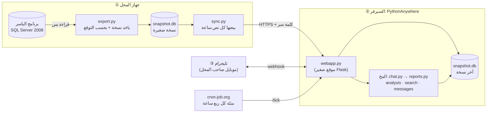
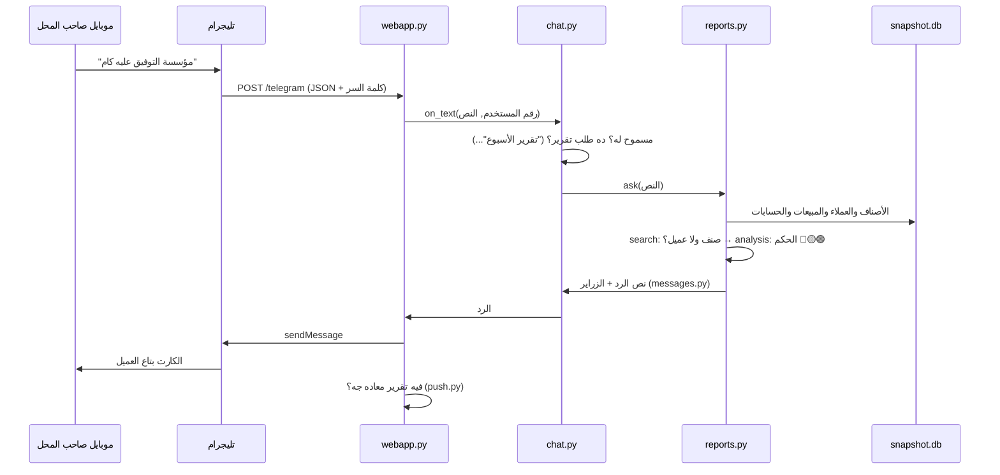

# المشروع من جوه: كل حتة ومربوطة بإيه

الملف ده للي هيبقى مسؤول عن المشروع (الـ founder): إيه اللي بيحصل، فين، وليه، وتبص على كل
حاجة منين. في الآخر قاموس لكل المصطلحات.

---

## 1. الصورة الكبيرة في دقيقة

فيه **3 أماكن** بس، وكل واحد ليه شغلانة:

- **جهاز المحل** عليه البيانات الحقيقية. بناخد منها **نسخة** صغيرة كل نص ساعة ونبعتها.
  عمرنا ما بنكتب في برنامج الياسر.
- **السيرفر** شغال 24 ساعة. شايل آخر نسخة، وبيرد منها على الرسايل وبيبعت التقارير.
- **تليجرام** هو الواجهة: صاحب المحل بيكتب، تليجرام يوصّل الرسالة للسيرفر، والسيرفر يرد.

ليه كده؟ لأن جهاز المحل بيتقفل بالليل. لو البوت كان بيقرا من الجهاز على طول كان هيقف معاه.
فصلنا "مصدر البيانات" عن "اللي بيرد"، والرابط بينهم **ملف نسخة** (snapshot).

---

## 2. الأماكن بالتفصيل

### ① جهاز المحل (Windows)

| الحاجة | هي إيه | تبص عليها منين |
|---|---|---|
| برنامج الياسر | برنامج الحسابات. بيحفظ كل حاجة في قاعدة بيانات **SQL Server 2008 Express** | البرنامج نفسه |
| ملف قاعدة البيانات | ملف `.MDF` في فولدر البرنامج. البرنامج بيفتحه كـ **User Instance**: نسخة SQL Server خاصة بتشتغل بس وهو مفتوح | من اللابتوب على النسخة المرجّعة بـ SSMS (تحت) |
| فولدر `car-bot` | الكود + `.venv` (بايثون ومكتباته) + `.env` (الإعدادات والأسرار) | File Explorer |
| `data\snapshot.db` | آخر نسخة اتعملت | برنامج **DB Browser for SQLite** (مجاني) |
| `data\sync.log` | سجل كل إرسال: نجح ولا لأ وليه | Notepad |
| المهمة "car-bot sync" | Windows بيشغّل `src.sync` لما الجهاز يفتح، وكل نص ساعة، من غير شباك | `Win+R` ← `taskschd.msc` ← Task Scheduler Library |

**ليه لازم برنامج الياسر يبقى مفتوح؟** لأن قاعدة البيانات بتبقى "صاحية" بس وهو مفتوح
(User Instance). الكود بيدوّر عليها من خلال SQL Server الأساسي (`sys.dm_os_child_instances`)،
ويوصلها من "ماسورة" اسمها named pipe. لو البرنامج مقفول، الـ log بيكتب
`ELYASSER is not open` ويحاول تاني بعد نص ساعة. مفيش حاجة بتبوظ.

### ② السيرفر: PythonAnywhere

**نوع الكلاود ده اسمه PaaS** (Platform as a Service): بيدّيك جهاز Linux جاهز عليه
Python وسيرفر ويب، وإنت بترفع الكود بس. مش بتدير الجهاز نفسه.

| النوع | يعني إيه | مثال |
|---|---|---|
| **IaaS** | بتأجر جهاز فاضي وإنت تسطّب وتدير كل حاجة | AWS EC2، Azure VM، DigitalOcean |
| **PaaS** | منصة جاهزة، إنت ترفع الكود | **PythonAnywhere**، Railway، Render، Heroku |
| **SaaS** | برنامج جاهز بتستخدمه | Gmail، تليجرام، **البوت ده نفسه لو بعناه لمحلات** |
| **Serverless** | كود صغير بيصحى مع كل طلب وبتدفع بالاستخدام | AWS Lambda، Cloudflare Workers |

اللي شغال على السيرفر:

| الحاجة | هي إيه | تبص عليها منين (من موقع PythonAnywhere) |
|---|---|---|
| الموقع `https://USER.pythonanywhere.com` | Web app بـ **Flask** (`src/webapp.py`) | تبويب **Web**: زرار Reload، والـ logs |
| `/` | صفحة بتقول `car-bot is up` | افتحها في المتصفح |
| `/telegram` | تليجرام بيبعت هنا كل رسالة (webhook) | `python -m src.webhook info` في Bash |
| `/upload` | جهاز المحل بيبعت هنا النسخة | error log / server log |
| `/tick` | المنبّه بيخبّط هنا: "فيه تقرير معاده جه؟" | افتحه في المتصفح: `{"sent":[...]}` |
| `~/car-bot/data/snapshot.db` | آخر نسخة وصلت | تبويب **Files**، أو `python -m src.cli check` |
| `~/car-bot/data/state.db` | ذاكرة البوت (آخر تقرير وقف فين، اتبعت إيه النهارده) | Bash: `sqlite3 data/state.db "select * from kv"` |
| `~/car-bot/.env` | التوكن والأسرار والمستخدمين المسموحين | تبويب **Files** |

**الـ logs** (أهم حاجة لما حاجة تبوظ) في تبويب Web تحت "Log files":
- **error log**: أي خطأ حصل في الكود.
- **server log**: السيرفر اشتغل واترستر إمتى.
- **access log**: كل طلب وصل (تليجرام، رفع، tick).

حدود الخطة المجانية:
- موقع واحد.
- تجدده مرة كل شهر من زرار في تبويب Web.
- مفيش Scheduled Tasks للحسابات الجديدة، عشان كده بنستخدم cron-job.org.
- النت من السيرفر للخارج مسموح لمواقع معيّنة بس، وتليجرام منهم.

### ③ تليجرام

- **البوت** حساب اتعمل من **@BotFather**. معاه **token**، وده باسورد البوت: اللي معاه
  يتحكم فيه، فمتبعتهوش لحد.
- **Webhook**: قلنا لتليجرام "كل رسالة للبوت ابعتها على `https://USER.pythonanywhere.com/telegram`".
  ده اتعمل مرة واحدة بـ `python -m src.webhook set ...`.
  - تليجرام بيبعت مع كل رسالة **كلمة سر** (`WEBHOOK_SECRET`)، والسيرفر يرفض أي حاجة من غيرها.
- **Long polling** (البديل): البوت هو اللي بيسأل تليجرام كل شوية "فيه رسايل؟".
  ده اللي `src/bot.py` بيعمله على اللابتوب للتجربة. **مينفعش الاتنين بنفس التوكن في نفس الوقت.**
- **مين يقدر يستخدمه**: بس الأرقام اللي في `ALLOWED_USERS`. أي حد تاني بياخد رقمه بس.
  والرقم هنا يعني **رقم حسابه على تليجرام** (user id)، مش رقم الموبايل.

### ④ cron-job.org

موقع مجاني بيفتح `https://USER.pythonanywhere.com/tick` كل ربع ساعة. ده "المنبّه" اللي بيخلّي
تقرير آخر اليوم وتقرير الأسبوع يطلعوا في معادهم. تشوف كل مرة خبّط فيها ونتيجتها من
صفحة الـ job ← **History**.

### ⑤ GitHub

"بيت الكود". كل تعديل بيتحفظ كـ **commit** باسمك. الكود بيوصل للسيرفر ولجهاز المحل بـ `git pull`.
- **Branch**: نسخة جانبية من الكود بنشتغل عليها لحد ما تجهز.
- **Pull Request (PR)**: طلب دمج الـ branch في `main`، بتشوف فيه التغييرات قبل ما تدمجها.
- مفيش تحديث أوتوماتيك: كود جديد على GitHub **مش** بيوصل للسيرفر غير لما تعمل
  `git pull` هناك وتدوس Reload.

---

## 3. رحلة رسالة واحدة (من الموبايل للرد)

صاحب المحل كتب: **"مؤسسة التوفيق عليه كام"**

بالتفصيل:
1. تليجرام بيبعت الرسالة للسيرفر كـ **JSON**، ومعاها كلمة السر في الـ header.
2. `webapp.py` بيتأكد من كلمة السر، ويسلّم النص لـ `chat.py`.
3. `chat.py` بيسأل كذا سؤال بالترتيب:
   - الشخص ده مسموح له؟ لو لأ يرد برقمه بس.
   - الرسالة أمر زي `/weekly`؟
   - زرار من الكيبورد زي "📊 النهارده"؟
   - جملة تقرير زي "تقرير الأسبوع" (`report_asked`)؟
   - لو ولا واحدة منهم: يبقى سؤال عن صنف أو عميل (`reports.ask`).
4. `search.py` بيقارن الكلام بأسماء الأصناف والعملاء:
   - يوحّد الإملا الأول: أ/إ/آ ← ا، ة ← ه، الأرقام العربي ← إنجليزي.
   - بعدين يدي **درجة تشابه** (fuzzy).
   - لو فيه أكتر من واحد قريبين، يطلّعهم زراير يختار منهم.
5. `reports.py` بيجيب البيانات من النسخة (`shop.py`)، ويحسب:
   - الأرصدة والمبيعات
   - حكم العميل (`analysis.py`)
   - التوقع
6. `messages.py` بيحوّل الأرقام لجُمل بالمصري: "عليه 82,345 ج · مدفعش من 60 يوم".

### التحصيل وتكلفة الآجل (الحسبة بالبلدي)

- **أيام التحصيل** = اللي على التاجر ÷ اللي بياخده آجل في اليوم (آخر 3 شهور). يعني لو
  بياخد بـ 1,000 ج في اليوم وعليه 60,000 ج، يبقى فلوسه بتقعد عنده حوالي 60 يوم (8.5 أسبوع).
- المحل عايز الفلوس ترجع في **6 أسابيع** (`COLLECT_WEEKS`). أكتر من كده: 🟡. أكتر من
  الضعف وعليه 5,000+ ومش بيقلّل اللي عليه: 🔴.
- **تكلفة الآجل (تقدير)**: الفلوس اللي قاعدة عند التاجر كان ممكن تشتغل وتكسب حوالي 2% في
  الشهر (`MONEY_COST_MONTHLY`). فالمكسب بعد الآجل = المكسب − نسبة الآجل × 2% × (أيام
  التحصيل ÷ 30). مثال: مكسب 22%، 85% آجل، 7 أسابيع تحصيل ← حوالي 19%. البوت بيكتب
  جنبها "تقدير" عشان محدش يفتكرها رقم من البرنامج.
7. `telegram_api.py` بيبعت الرد لتليجرام، وتليجرام يوصّله للموبايل.
8. في الآخر، `push.py` بيشوف لو فيه تقرير معاده جه ولسه متبعتش، فيبعته.

---

## 4. رحلة البيانات (من الياسر للبوت)

كل نص ساعة على جهاز المحل (`src/sync.py`):
1. **`export.py` يتصل** بقاعدة بيانات الياسر. بيدوّر على الـ User Instance، ويختار أكبر قاعدة بيانات فيها.
2. **يقرا بس**: 10 استعلامات `SELECT … WITH (NOLOCK)`، فالبرنامج عمره ما بيستنّاه، ومفيش ولا
   كتابة. بيقرا:
   - الأصناف
   - العملاء (من غير أرقام تليفونات أو عناوين)
   - فواتير البيع وسطورها
   - المرتجعات
   - السطور الممسوحة
   - حسابات العملاء وقيود الحسابات (منها المديونيات والدفعات)
   - أول وآخر مرة كل صنف وصل من مورد (من دفتر المخزن `Item_store`)، عشان البضاعة اللي
     لسه واصلة متتحسبش راكد. لو الجدول ده مااتقراش لأي سبب، النسخة بتتعمل من غيره.
3. **يحوّل** الأرقام والنصوص لشكل نضيف (مثلًا يشيل المسافات الزيادة من الأسماء).
4. **التوقع**: مرة واحدة في اليوم، بيجرّب 5 طرق على مبيعات الشهور اللي فاتت ويختار الأدق.
   باقي اليوم بيعيد استخدام نتيجته.
5. **يكتب** `snapshot.db`: بيكتب ملف مؤقت الأول وبعدين يبدّله. كده اللي بيقرا عمره ما يشوف
   نص ملف.
6. **`sync.py` يضغطه** (gzip) ويبعته لـ `/upload` ومعاه `UPLOAD_TOKEN`. لو النت وقع
   يحاول 3 مرات.
7. **السيرفر** يتأكد إنه ملف سليم (فيه الجداول المطلوبة)، ويبدّل القديم بالجديد، ويشوف لو
   فيه تقرير معاده جه.

### التقارير اللي بتطلع لوحدها (`src/push.py`)

| التقرير | إمتى | شرط |
|---|---|---|
| تحديث العصر | أول فرصة بعد `DAILY_UPDATE` (4:30) | المحل بعت نسخة النهارده |
| آخر اليوم | أول فرصة بعد `END_OF_DAY` (11:30)، لحد 6 الصبح | المحل بعت نسخة من 6 الصبح |
| الأسبوع | مع آخر اليوم، يوم `WEEKLY_DAY` (الخميس) | — |

"أول فرصة" = أول مرة حاجة تخبّط على السيرفر بعد المعاد: نسخة من المحل، أو رسالة، أو
cron-job.org. كل تقرير بيتبعت **مرة واحدة** لليوم. اليوم بيخلص 6 الصبح مش 12، لأن المحل
بيشتغل لبعد نص الليل.

---

## 5. قواعد البيانات: نوعين، وليه

| | **SQL Server** (برنامج الياسر) | **SQLite** (بتاعتنا) |
|---|---|---|
| هي إيه | قاعدة بيانات **علائقية** (relational) كبيرة من Microsoft، بتشتغل كـ "سيرفر" | قاعدة بيانات علائقية في **ملف واحد**، من غير سيرفر |
| مين بيكتب فيها | برنامج الياسر بس | `export.py` بيعمل النسخة، و`state.py` بيكتب ذاكرة البوت |
| اللغة | T-SQL (نوع من SQL) | SQL |
| ليه | ده اختيار البرنامج | خفيفة، ملف يتنقل ويتبعت، والسيرفر يقراها من غير ما يسطّب حاجة |
| تفتحها بإيه | **SSMS** (SQL Server Management Studio، مجاني) على النسخة المرجّعة على اللابتوب | **DB Browser for SQLite** (مجاني) |

"علائقية" يعني بيانات في **جداول** (زي شيتات Excel)، الجداول مربوطة ببعض بأرقام. مثلًا سطر
الفاتورة فيه رقم الصنف، ورقم الصنف ده بيوصلك لاسمه وسعره في جدول الأصناف.

**جداول النسخة (`snapshot.db`):**

| الجدول | فيه إيه |
|---|---|
| `items` | الأصناف: الاسم، الكود، الرصيد، سعر البيع، التكلفة |
| `customers` | العملاء: الاسم، رقم الحساب (من غير تليفون أو عنوان) |
| `invoices` / `invoice_lines` | فواتير البيع وسطورها: مين، إمتى، كام، المكسب |
| `returns` / `return_lines` | المرتجعات |
| `deleted_lines` | سطور اتمسحت من فواتير (بتتنبّه في آخر اليوم) |
| `accounts` / `ledger` | حسابات العملاء وكل قيد: مدين، دائن، ولو القيد دفعة |
| `forecasts` | التوقع لكل صنف: هيتباع منه كام في 30 يوم |
| `meta` | النسخة اتعملت إمتى، وطريقة التوقع اللي اتختارت ودقتها |

**ذاكرة البوت (`state.db`):** رقم آخر فاتورة غطاها تقرير آخر اليوم، وتقارير النهارده
اتبعت ولا لأ، والأسعار والأرصدة بتاعة امبارح عشان يقول "إيه اللي اتغير".

**ليه التقارير بتمشي بأرقام الفواتير مش تواريخها؟** لأن التاريخ في الياسر بيتكتب بالإيد، ومرة
لقينا فواتير متسجلة يوم 22 ومكتوب عليها 24. فتقرير آخر اليوم معناه "كل اللي اتسجل من آخر
تقرير"، بالرقم.

---

## 6. الملفات واحد واحد

### الداتا
| الملف | بيعمل إيه | بيكلّم مين |
|---|---|---|
| `src/config.py` | يقرا الإعدادات من `.env` | الكل |
| `src/export.py` | الياسر ← `snapshot.db` (+ التوقع) | SQL Server، `forecast.py` |
| `src/sync.py` | يشغّل export ويبعت النسخة للسيرفر | `export.py`، `/upload` |
| `src/shop.py` | يقرا من `snapshot.db` (أصناف، مبيعات، عملاء، أرصدة) | `reports.py` |
| `src/state.py` | ذاكرة البوت (`state.db`) | `reports.py`، `push.py`، `webapp.py` |

### المخ
| الملف | بيعمل إيه |
|---|---|
| `src/analysis.py` | الحسابات: الرصيد يكفي كام يوم، النواقص وكام نطلب، الراكد، مين اشترى إيه، حكم العملاء 🔴🟡🟢، والتحصيل وتكلفة الآجل |
| `src/forecast.py` | التوقع: الموديل، الطرق البسيطة، الاختبار على الماضي، واختيار الأدق |
| `src/search.py` | يلاقي الصنف أو العميل من كلام مكتوب بأي شكل |
| `src/normalize.py` | يوحّد الإملا العربي قبل المقارنة |

### الكلام
| الملف | بيعمل إيه |
|---|---|
| `src/messages.py` | كل الجُمل بالمصري: الكروت، التقارير، الأرقام ("195 ألف ج") |
| `src/reports.py` | "إيه اللي البوت يقوله": يجمع البيانات والحسابات والجُمل والزراير |
| `src/chat.py` | "مين كتب إيه ← نرد بإيه": نفس المخ للسيرفر وللابتوب |

### التوصيل
| الملف | بيعمل إيه |
|---|---|
| `src/webapp.py` | السيرفر (Flask): `/telegram`، `/upload`، `/tick` |
| `src/telegram_api.py` | يبعت ويعدّل الرسايل على تليجرام |
| `src/push.py` | أنهي تقرير معاده جه، ويبعته لكل المسموحين |
| `src/webhook.py` | يقول لتليجرام عنوان السيرفر (مرة واحدة) |
| `src/bot.py` | نفس البوت على اللابتوب (long polling) للتجربة |

### أدوات
| الملف | بيعمل إيه |
|---|---|
| `src/cli.py` | ردود البوت في الـ terminal من غير تليجرام |
| `src/demo.py` | البوت على **محل وهمي** (للعرض والتجربة) |
| `tools/discover.ps1`، `probe.ps1` | لقوا قاعدة البيانات واختبروا الفرضيات |
| `tools/backup.ps1`، `restore.ps1` | نسخة احتياطية من جهاز المحل وترجيعها على اللابتوب |
| `tools/check_balances.py` | اتأكد إن حساب المديونيات زي البرنامج بالظبط |
| `tools/install_sync.ps1` | يعمل مهمة الإرسال كل نص ساعة على جهاز المحل |

### الاختبارات والإعدادات
| الملف | بيعمل إيه |
|---|---|
| `tests/` | 139 اختبار. `tests/fake_shop.py` بيعمل **محل وهمي** بإجابات معروفة، والاختبارات بتتأكد إن البوت بيطلعها |
| `tests/elyasser_replica.sql` | نسخة من شكل جداول الياسر، لاختبار الاستعلامات على SQL Server حقيقي |
| `.env` | الأسرار والإعدادات. **مش على GitHub أبدًا** |
| `.env.example` | شكل `.env` من غير أسرار |
| `requirements*.txt` | المكتبات: `-shop` لجهاز المحل، `-server` للسيرفر، `-dev` لكله |
| `.gitignore` | الحاجات اللي git يتجاهلها: `.env`، الداتا، النسخ الاحتياطية |

---

## 7. جزء الـ AI ببساطة

**السؤال:** كل صنف هيتباع منه كام في الـ 4 أسابيع الجاية؟ لو عرفنا ده، نعرف النواقص وكام
نطلب.

- **الموديل (Machine Learning):** بندّيله لكل صنف حاجات عن ماضيه، ودي اسمها **features**:
  - اتباع كام الأسبوع اللي فات واللي قبله
  - متوسط آخر 4 و13 و52 أسبوع
  - بيتباع كل قد إيه
  - من إمتى آخر بيعة
  - سعره
  - نفس الأسابيع السنة اللي فاتت
  
  وبنوريه الإجابات الصح من الماضي، وده اسمه **training**، فيتعلّم العلاقة.
  النوع اسمه **Gradient Boosting**: شجرات قرار كتير صغيرة، كل واحدة بتصلّح غلط اللي قبلها.
  **Poisson** يعني بنقوله إن اللي بيتوقعه "عدد قطع"، مش أي رقم.
- **الطرق البسيطة (baselines):** متوسط آخر 8 أسابيع، متوسط آخر 13 أسبوع، وطريقة **Croston**
  (معمولة مخصوص للحاجات اللي بيعها متقطع).
- **الاختبار على الماضي (backtest):** نخبّي آخر 4 أسابيع، ونخلّي كل طريقة تتوقعهم من اللي
  قبلهم، ونقارن بالحقيقة. ونكرر ده 4 مرات من نقط مختلفة.
- **المقياس (WAPE):** مجموع الغلط ÷ مجموع اللي اتباع. 86% يعني الطريقة غلطت بما يساوي 86%
  من اللي اتباع فعلًا. كل ما يقل أحسن.
- **الانحياز (bias):** الطريقة بتتوقع أكتر (+) ولا أقل (−) من الحقيقة في المجموع.
- **التسريب (leakage):** غلطة مشهورة، إن الموديل يشوف المستقبل وهو بيتعلم فيطلع شاطر على الورق
  بس. فيه اختبار بيتأكد إن ده مش بيحصل.
- **النتيجة على داتا المحل:** متوسط 13 أسبوع كسب (86.1%) والموديل خسر (90.6%). فالبوت بيستخدم
  متوسط 13 أسبوع. والاختيار ده بيتعاد كل يوم لوحده.
- **حكم العملاء 🔴🟡🟢 مش AI:** ده **قواعد** مكتوبة بالأرقام. معندناش تاريخ لعملاء "ضربوا"
  فعلًا عشان موديل يتعلم منه، وصاحب المحل محتاج يشوف **السبب**.

---

## 8. الأمان والخصوصية

- **قراءة بس** من قاعدة بيانات الياسر، و`NOLOCK` عشان البرنامج عمره ما يستنّى.
  فيه اختبار بيرفض أي استعلام مش `SELECT`.
- **الأسرار في `.env` بس، ومش على GitHub:**
  - `TELEGRAM_TOKEN`: باسورد البوت.
  - `WEBHOOK_SECRET`: عشان محدش غير تليجرام يكلّم `/telegram`.
  - `UPLOAD_TOKEN`: عشان محدش غير جهاز المحل يرفع نسخة.
- **HTTPS**: كل حاجة بين الجهاز والسيرفر وتليجرام متشفّرة.
- **مين يستخدم البوت**: `ALLOWED_USERS` بس.
- **النسخة من غير** تليفونات أو عناوين العملاء. والصور والديمو كلهم من **محل وهمي**.

---

## 9. عايز تشوف … تروح فين

| عايز تشوف | تروح فين |
|---|---|
| البوت شغال؟ | افتح `https://USER.pythonanywhere.com` ← `car-bot is up` |
| تليجرام واصل للسيرفر؟ | Bash على PythonAnywhere: `python -m src.webhook info` |
| آخر نسخة وصلت إمتى؟ | في البوت نفسه: "🕒 آخر تحديث من المحل"، أو `python -m src.cli check` |
| جهاز المحل بيبعت؟ | `C:\car-bot\data\sync.log` |
| المهمة شغالة على جهاز المحل؟ | `taskschd.msc` ← "car-bot sync" ← Last Run Result |
| خطأ في السيرفر | PythonAnywhere ← Web ← error log |
| المنبّه شغال؟ | cron-job.org ← الـ job ← History |
| جوه النسخة | DB Browser for SQLite ← افتح `snapshot.db` |
| جوه قاعدة بيانات الياسر | SSMS على اللابتوب ← `ELyasserDB` (النسخة المرجّعة) |
| الكود وتاريخه | GitHub ← الريبو ← Commits |
| ردود البوت من غير تليجرام | `python -m src.cli ask "كويل لانوس"` أو `python -m src.demo` |
| دقة التوقع | `python -m src.forecast` |

---

## 10. قاموس المصطلحات

### البرمجة والكود
- **Python**: لغة البرمجة اللي المشروع مكتوب بيها.
- **مكتبة (library / package)**: كود جاهز بنستخدمه، زي Flask وscikit-learn. بتتسطّب بـ **pip**.
- **venv (virtual environment)**: فولدر `.venv` فيه بايثون ومكتبات المشروع بس، عشان ميتلخبطش
  مع حاجات تانية على الجهاز.
- **requirements.txt**: قايمة المكتبات بإصداراتها بالظبط، عشان أي جهاز يسطّب نفس الحاجة.
- **module**: ملف `.py`. و`python -m src.bot` يعني "شغّل الملف `src/bot.py`".
- **Terminal / PowerShell / Bash**: الشباك الأسود اللي بتكتب فيه أوامر.
- **Environment variables / `.env`**: إعدادات وأسرار برّه الكود، عشان الكود يتنشر والأسرار لأ.
- **Log**: سجل بيكتب فيه البرنامج بيعمل إيه وحصل إيه، أول حاجة تبص عليها لما حاجة تبوظ.
- **Test / pytest**: كود بيتأكد إن الكود التاني بيطلع الإجابات الصح. بيتشغّل بـ `python -m pytest`.
- **Git**: بيحفظ تاريخ كل تعديل. **Commit** = حفظة، **Branch** = نسخة جانبية، **Merge** = دمج،
  **Pull** = هات آخر نسخة، **Push** = ارفع.
- **GitHub**: موقع شايل الـ repo (مكان الكود). **Pull Request** = طلب دمج بتراجعه قبل ما يدخل.

### الداتا
- **Database (قاعدة بيانات)**: برنامج بيحفظ البيانات منظمة ويرد على أسئلة عنها.
- **Relational / جداول**: البيانات في جداول مربوطة بأرقام (IDs).
- **SQL**: لغة الأسئلة على قواعد البيانات. `SELECT` = هات، `INSERT/UPDATE/DELETE` = اكتب،
  وإحنا بنستخدم `SELECT` بس.
- **Query (استعلام)**: سؤال واحد بـ SQL.
- **Index**: فهرس بيخلّي البحث في جدول كبير سريع.
- **SQL Server / Express**: قاعدة بيانات Microsoft. Express هي النسخة المجانية المحدودة.
- **User Instance**: نسخة SQL Server خاصة ببرنامج واحد، بتصحى وهو مفتوح بس.
- **ODBC / driver / pyodbc**: "المترجم" اللي بيخلّي بايثون يكلّم SQL Server.
- **NOLOCK**: اقرا من غير ما تقفل الجدول، فالبرنامج الأصلي مايستنّاش.
- **SQLite**: قاعدة بيانات في ملف واحد، من غير سيرفر.
- **Snapshot**: نسخة من البيانات في لحظة معيّنة.
- **ETL**: Extract / Transform / Load: اسحب، ظبّط، حمّل. هو ده اللي `export.py` بيعمله.
- **OLTP vs Analytics**: قاعدة البرنامج اتعملت عشان **تسجّل** الفواتير بسرعة (OLTP). نسختنا
  معمولة عشان **نحلل**، فبنفصلهم عشان التحليل ميتقّلش على البرنامج.
- **Backup / Restore**: نسخة احتياطية كاملة، وترجيعها على جهاز تاني.

### الويب والكلاود
- **Server (سيرفر)**: جهاز شغال على طول بيرد على طلبات.
- **Cloud**: تأجير سيرفرات من شركة بدل ما تشتري جهاز. (IaaS / PaaS / SaaS / Serverless فوق في الجدول.)
- **Hosting**: المكان اللي الموقع أو البوت "ساكن" فيه.
- **URL / Domain**: العنوان، زي `USER.pythonanywhere.com`.
- **HTTP / HTTPS**: لغة الكلام بين المتصفح أو البرنامج والسيرفر. S = متشفّرة.
- **API**: "باب" لبرنامج يكلّم برنامج تاني بقواعد معروفة، زي Telegram Bot API.
- **Endpoint**: عنوان باب معيّن في الـ API، زي `/upload`.
- **GET / POST**: GET = هات، POST = خُد (بتبعت بيانات).
- **JSON**: شكل نصي لتبادل البيانات بين البرامج.
- **Webhook**: "كلّمني إنت لما يحصل حاجة"، بدل ما أسأل كل شوية.
- **Polling**: أسأل كل شوية "فيه جديد؟".
- **Flask**: مكتبة بايثون صغيرة لعمل مواقع وAPIs.
- **WSGI**: الطريقة الموحّدة اللي سيرفر الويب بيشغّل بيها كود بايثون.
- **gzip**: ضغط الملف قبل ما يتبعت.
- **Token / Secret / Bearer**: كلمة سر طويلة بتتبعت مع الطلب تثبت إنت مين.
- **Cron / Scheduled task**: تشغيل حاجة في مواعيد ثابتة.
- **Idempotent**: لو اتعملت مرتين النتيجة زي مرة. التقرير مش بيتبعت مرتين في نفس اليوم.
- **Uptime**: نسبة الوقت اللي الخدمة شغالة فيه.

### تليجرام
- **Bot / BotFather**: حساب آلي، بيتعمل من BotFather.
- **Token**: باسورد البوت.
- **User id / Chat id**: رقم الشخص والشات عند تليجرام.
- **Keyboard / Inline buttons**: زراير تحت خانة الكتابة، وزراير تحت الرسالة نفسها.
- **Callback**: لما حد يدوس زرار تحت رسالة، تليجرام يبعت "داس على كذا".

### الـ AI والـ ML
- **Model**: برنامج اتعلّم من أمثلة إزاي يطلّع إجابة.
- **Feature**: معلومة بنديها للموديل، زي "اتباع كام الأسبوع اللي فات".
- **Training / Prediction**: التعلّم من الماضي، والتوقع للجاي.
- **Time series**: بيانات مرتبة بالزمن، زي مبيعات كل أسبوع.
- **Intermittent demand**: طلب متقطع، أسابيع كتير صفر وفجأة بيعة.
- **Baseline**: الطريقة البسيطة اللي أي موديل لازم يغلبها عشان يستاهل.
- **Backtest**: اختبار الطريقة على الماضي كأنه مستقبل.
- **WAPE / bias**: مقياس الغلط، واتجاهه (أكتر ولا أقل).
- **Overfitting**: الموديل حفظ الماضي بدل ما يفهمه، فيفشل في الجديد.
- **Leakage**: الموديل شاف معلومة من المستقبل وهو بيتعلم.
- **Gradient boosting**: شجرات قرار كتير كل واحدة بتصلّح غلط اللي قبلها.
- **Rule-based**: قواعد مكتوبة بإيد إنسان (زي حكم العملاء)، مش متعلّمة.
- **LLM**: موديل لغة كبير زي ChatGPT وClaude. **المشروع ده مفيهوش LLM**، والبحث بالعربي
  معمول بمقارنة نصوص (fuzzy matching).

### البيزنس والـ startup
- **KPI**: رقم بيقيس إنت ناجح ولا لأ، زي "كام مرة صاحب المحل سأل البوت في الأسبوع".
- **MVP**: أصغر نسخة من المنتج تحل المشكلة وتتجرب. البوت ده دلوقتي MVP.
- **Pilot**: تجربة المنتج مع عميل واحد حقيقي قبل ما تبيعه لكتير. أول محل اشتغل عليه = pilot.
- **Product-market fit**: الناس محتاجة المنتج لدرجة إنها تدفع فيه وتفضل تستخدمه.
- **SaaS subscription**: العميل بيدفع اشتراك شهري بدل ما يشتري مرة.
- **MRR / ARR**: الدخل الشهري أو السنوي المتكرر من الاشتراكات.
- **Churn**: نسبة العملاء اللي بيلغوا الاشتراك.
- **CAC**: بتصرف كام عشان تجيب عميل واحد.
- **LTV**: العميل بيدفعلك كام طول ما هو معاك. لازم LTV أكبر بكتير من CAC.
- **Onboarding**: تركيب المنتج للعميل الجديد وتعليمه عليه.
- **Multi-tenant**: سيرفر واحد بيخدم محلات كتير، وكل محل شايف بياناته بس. ده اللي هتحتاجه
  لو بعت لأكتر من محل.
- **SLA**: وعدك للعميل: الخدمة شغالة قد إيه، وبتصلّح في قد إيه.
- **Unit economics**: كل عميل بيكسّبك كام بعد تكلفته (سيرفر، دعم، وقت).
